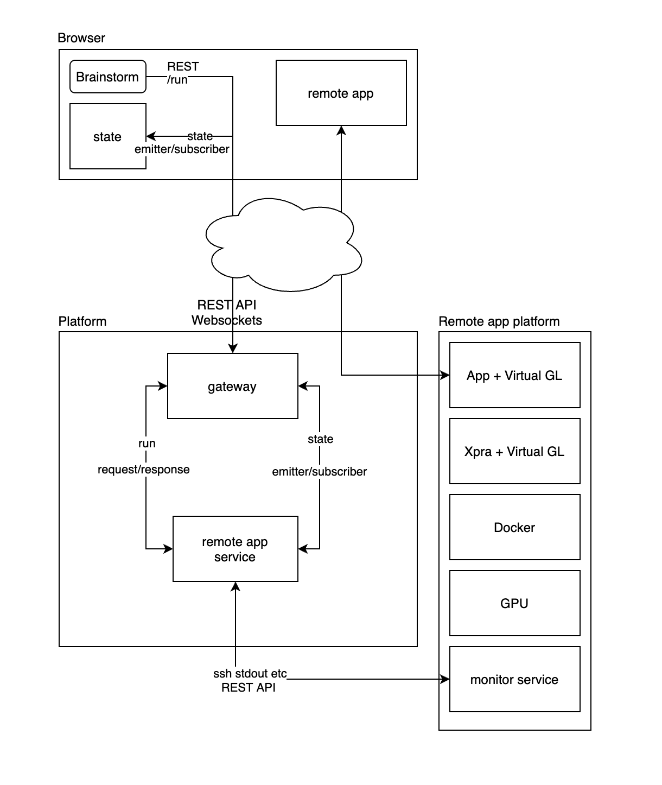

# Human Intracerebral EEG Platform 

Gateway and services for the HIP

## Current proof of concept
as of 2014.04.02, the goal is to connect a web interface to the [App in browser](https://github.com/HIP-infrastructure/app-in-browser) in order to fire process, get feedbacks etc. 

 

[Server and App Sequences](https://xstate.js.org/viz/?gist=5390ee0dbd82b6c12d9c1c3b5d542837)
